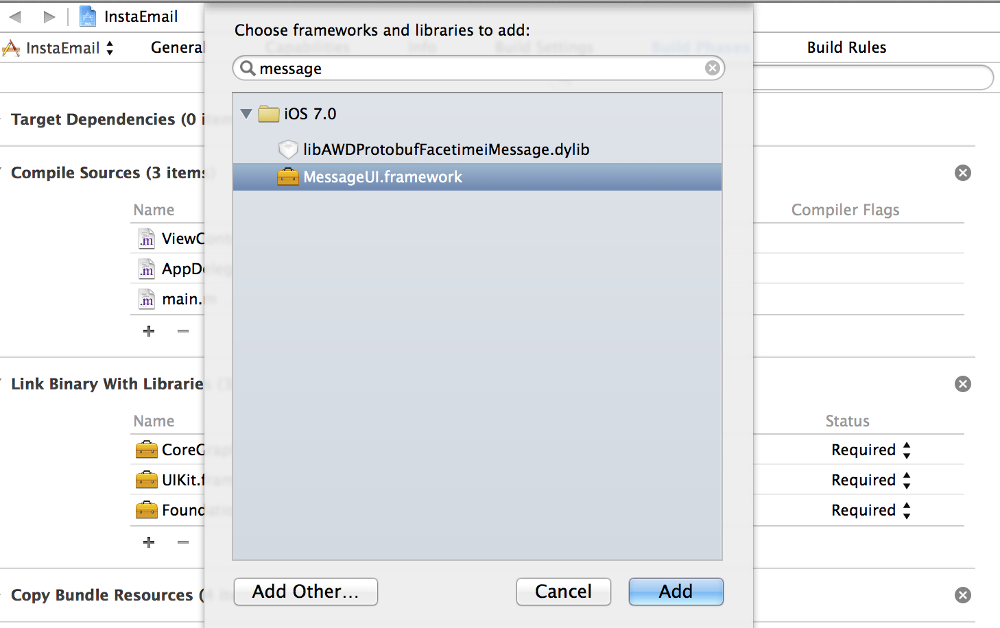

#Ch02 - IOS 應用程式設計模式

這篇筆記除了是 Head First 第二章的心得之外，還包含一些延伸的學習筆記。算是非常片段的筆記，建議看過 Head First 之後再來看吧。

* Q: 如何規劃你的應用程式配置? 
* A: 一切從草圖開始 -> 建立 GUI -> 規劃如何使用畫面的控制項 -> 處理資料。
* 使用性跟美感是 iPhone 的成功關鍵。

## IOS HIG 應用程式設計規則
> ios Human Interface Guide (HIG，人機介面指南)

* Apple 公司有發佈一份文件作為指導如何開發要在 App Store 要賣的 APP，當你要準備送審 APP 時，你必須同意你的 APP 符合 HIG 規範。

## HIG 的三種類型
HIG 有三種應用程式的開發類型，用以符合不同需求的應用程式，這三種分別是:

####1. 生產力應用程式 (Productivity App)
* 顯示方式偏好管理介面，階層式架構的資訊顯示方式。 

####2. 融入式應用程式 (Immersive App)
* 比較自由的 GUI 介面，HIG 對這類 App 的審核比較寬鬆，最好的例子是遊戲。 
	 	

####3. 工具應用程式 (Utility App)
*  盡可能少提供設定的功能給使用者，通常是提供特定資訊而已。通常這類的 App 會比較嚴格的要求符合 HIG。 

#####因為現在已經到了 IOS7 了，歡迎參考最新的文章 : [iOS 7 Design Resources   iOS Human Interface Guidelines](https://developer.apple.com/library/ios/documentation/userexperience/conceptual/mobilehig/)

##關於 IOS7 的設計
### IOS7 介面的解剖
* 幾乎所有的 App 都會需要使用 UIKit Framework 來定義畫面的 UI 組件，了解各個組件的名稱, 角色, 以及功能為何有助於節省開發 App 的時間。

舉例來說，以下是一些常見的 UI 元件 (個人覺得，了解各個組件的名稱與定義也能減少團隊開發之間溝通的障礙，不過如果 co-worker 都是有經驗的老手，應該會很少有這樣的問題 :P )：( 參考 [Apple Developer 的說明文件之圖](https://developer.apple.com/library/ios/documentation/userexperience/conceptual/mobilehig/Art/uikit_ui_elements_2x.png)。)

### UIKit 提供的 UI 元素可分為四大類
* 分別是 Bars, Content Views, Controls, Temporary views, 通常建議記住英文名詞。
* 我必須說這一定不會是最新版的情況， Apple 的版本會不斷的更新。

| UI 元素 | 中文名詞 | 解釋 | 常見 UI 種類
|:-----------|:------------|:------------|:--- |
| Bars       |  欄 |    Bars 用來讓使用者瀏覽或操作該 App 的上下文訊息。| Status Bar(狀態欄), Navigation Bar(導航欄), ToolBar(工具欄), Tab Bar(標簽欄)   
| Content Views    |   內容視圖 |  Content views 呈現該 App 特定的內容，而且也可以包含一些行為，像是 scrolling(滾動), insertion(插入/新增), deletion, 以及資料的安排方式。 | Map View, Image View, Collection View, Scroll View, Table View. 
| Controls       |     控制器 |    Controls 用來呈現資訊跟設定的動作。 | Page View Controller.   
| Temporary views| 臨時視圖 |     臨時視圖顯示短暫的重要信息或額外的選擇和功能給用戶。     

* 因為 UI 的部分是很龐大的內容，在此章不再多介紹摟，再寫下去就離題了 XD
* 你需要了解各種標準控制項的適當使用時機，建構視圖之前可以先參考 Apple 提供的 iOS UI Element Usage Guideline。

## 建立一個 View-Based Application
* 因為我 XCode 版本已經跟書本不同，以下簡單幾個新圖做解釋，主要是在 init 一個新專案時的操作介面可能有些不同。
* 這本書的範例要建立一個 View-Based Application，但在 Xcode 5 你已經找不到 View-Based Application 了(我現在的版本是 5.0.2)，但是你可以使用 `Single View Application` 取代之。

###步驟說明:
1. File
2. New
3. New Project
4. 選擇 Single View Application

* 按照書本的範例，我們也同樣將專案取名為 InstaEmail

* 因為這個專案是要製作一個寄送 E-Mail 功能的 App，因此我們需要針對這個 App 新增一個 Message UI Framework，選擇 『Build Phases』，開啟『Link Binary With Libraries』，按下 『＋』。

* 然後搜尋 message 之後找到&選擇 Message UI Framework，接下來跟書本差不多，就靠你了! :P 。
	

 

##Controller 從 Datasource 取得資料
* Controller 就是控制器。
* Cocoa Touch 有很多元素都具有 datasource (資料來源) 以及 delegate (受託者) 的概念。
* datasource 就是提供資料，controller 需要資料時會去跟 datasource 詢問並取得。
* 不同的 controller 需要不同的 datasource。比方說我們使用了 picker (選擇器) 的 controller，其 picker 的 datasource 就是 `UIPickerViewDatasource`。

	* 此圖為 picker 的 UI 組件
	

## 關於 Delegate
* delegate 就是委託者, 受託者，在現實生活中受託者就是幫你跑腿做事情的人。
* delegate 負責元素的行為，假如今天 picker 的值被改變了，controller (控制器) 就會通知 delegate 發生了什麼事，然後 delegate 就會做回應，執行正確的動作 (ex: 儲存或刪除或設定某個值)。
* 不同的 controller 除了有不同的 datasource，也有不同的 delegate，以 picker (選擇器) 來說，他的 delegate 就是 `UIPickerViewDelegate`。

## Controller-Datasource-Delegate 設計模式
* 幾乎所有的 UI 組件都具有這樣的設計模式 :  Controller-Datasource-Delegate (控制項/器 - 資料來源 - 受委託者)。
* 每個 Controller 都有特定相的 Datasoure 跟 Delegate，以及對其 datasource 和 delegate 有特定的需求。
* 在這個設計模式中，datasoure 跟 delegate 的責任是分開的。他們不一定要為特定的物件提供資料/內容 (不一定要分別實作在不同的類別)，對控制器來說，他只會跟 datasource 要他想要的資料; 跟 delegate 要求委託而來的東西。

## 協定定義 datasource 跟 delegate 要回應什麼訊息
* 協定 (也有書本或文章翻為協議)。
* 什麼是訊息 ? 大部分的 UI 控制項的類別都會具有特定的回應訊息。
* 協定是 Objective-C 的觀念，表示純界面 (Pure Interface)，協定經常應用於 Cocoa 中的 delegate (委託) 及事件觸發。
* 怎樣算是符合某個協定？ 當你的類別可以表達某個協定時，就是符合某個協定。
* 協定可以讓你知道你必須實作哪些方法。以 picker 來說， picker 的 datasource (UIPickerViewDatasource) 一定要實做 pickerView:titleForRow:forCOmponent 這個協定的方法，不實作就無法順利運行。
* 當然也有你可以不實作的協定，只是必要的協定一定要實作。

##參考:
* 參考書目: 深入淺出 iPhone 與 iPad 開發 (第二版)。
* [iOS 7 Design Resources iOS Human Interface Guidelines](https://developer.apple.com/library/ios/documentation/userexperience/conceptual/mobilehig/)
* [[ISUX转译]iOS7人机界面指南-UI元素(上)](http://isux.tencent.com/ios-human-interface-guidelines-ui-design-ios7-ui-1.html)